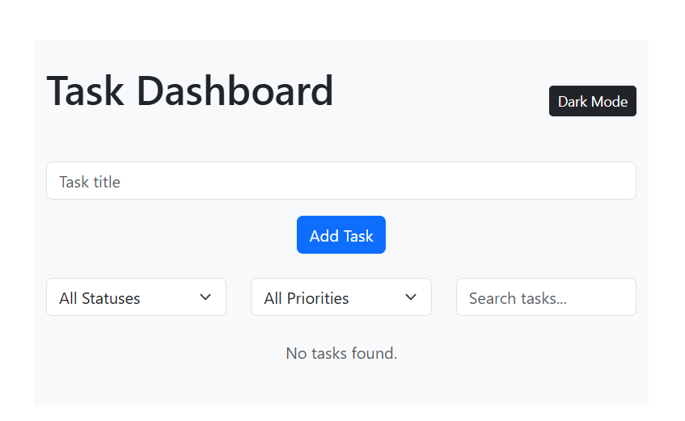

# Task Dashboard

## Description

A responsive, interactive landing page for a fictional banking and financial services company. Users can view a call-to-action modal designed to simulate a real pre-qualification application experience, including form entry, staged loading UI, and mock API response handling.

## Table of Contents

- [Technologies Used](#technologiesused)
- [Features](#features)
- [Future Features](#nextsteps)
- [Deployed App](#deployment)
- [About the Author](#author)
- [Reflection](#reflection)

## Technologies Used

- React
- TypeScript
- JavaScript
- HTML
- CSS
- Bootstrap
- Vite

##  Features

### Task Management

- Create new tasks using a controlled form
- Delete existing tasks
- Update task status dynamically
- Persist tasks using browser localStorage

### Filtering & Search

- Filter tasks by status
- Filter tasks by priority
- Search tasks by title
- Combine multiple filters simultaneously

### UI / UX

- Responsive layout using Bootstrap
- Clear visual hierarchy for tasks
- Status indicators for task progress
- User-friendly form validation feedback

### Future Features

- Implement drag-and-drop task reordering
- Improve accessibility (ARIA labels, keyboard navigation)
- Add task editing functionality

## Future Features

- Implement drag-and-drop task reordering
- Improve accessibility (ARIA labels, keyboard navigation)
- Add task editing functionality

## Deployed Link

[Github Pages](https://github.com/cgxgb123/task-dashboard)

- You can view the repository here:
  [Github](https://cgxgb123.github.io/task-dashboard/)
- If unable to view please go live locally through VS Code

## About The Authors

- **[Christian Blunt](https://www.linkedin.com/in/christiangblunt/)**

## Works Cited:

- https://developer.mozilla.org/en-US/docs/Learn_web_development/Core/Frameworks_libraries/React_interactivity_events_state
- https://developer.mozilla.org/en-US/docs/Learn_web_development/Core/Frameworks_libraries/React_components

## Reflection

### 1. How I Implemented React and TypeScript Features

I used React functional components along with hooks such as `useState` and `useEffect` to manage application state and side effects. TypeScript interfaces and union types were implemented to define the structure of tasks, filter options, and component props. This ensured type safety across the application and reduced runtime errors by enforcing consistent task statuses and priorities during development.

### 2. Challenges Encountered and How I Overcame Them

One of the main challenges was handling task status updates and filtering without causing unexpected behavior or application crashes. I initially encountered issues due to mismatched status values and improper component responsibilities. I resolved these problems by aligning all UI interactions with predefined TypeScript types and centralizing filtering logic in a utility function. Additionally, I ensured all state updates were performed immutably to maintain predictable React re-rendering.

### 3. Approach to Component Composition and State Management

I structured the application so that the `Dashboard` component serves as the single source of truth for shared state, including tasks and filters. Child components such as `TaskForm`, `TaskFilter`, and `TaskList` were designed to be focused and reusable, receiving data and callback functions through props. This approach allowed user interactions to flow upward in a controlled manner while keeping components loosely coupled and easy to maintain.
